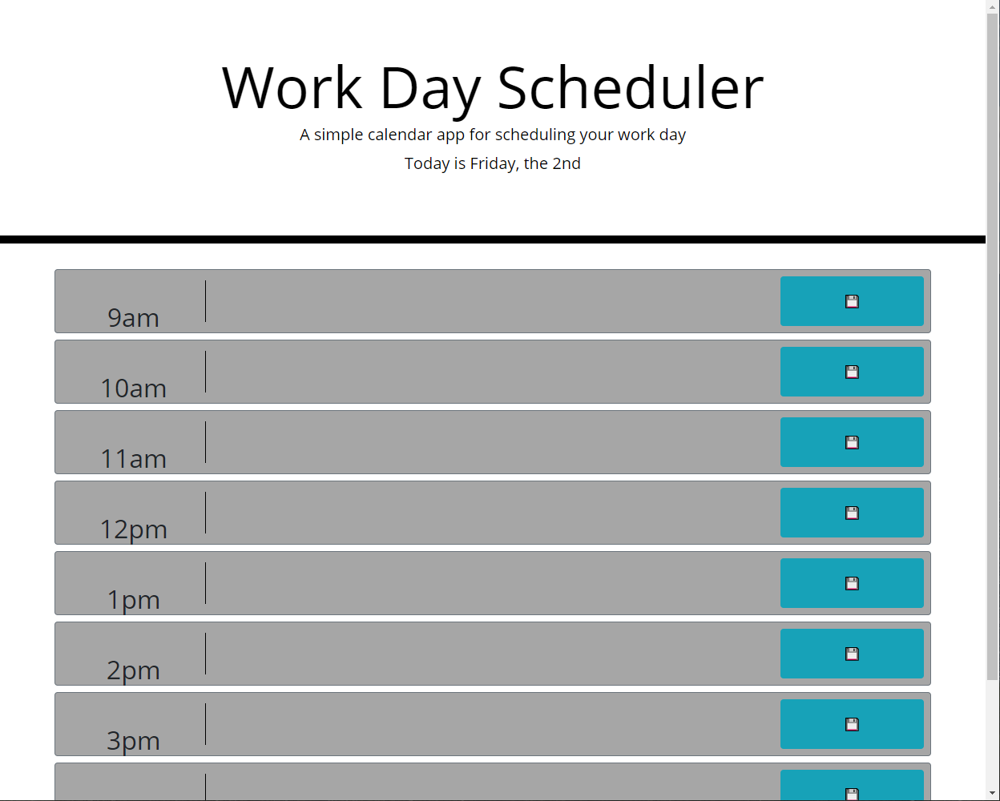

# 05-Work-Day_Scheduler

This is just a simple Work-Day Scheduler free for you to use. You can find it [here](https://markkhoo.github.io/05-Work-Day_Scheduler/)! Simply fill out what you need to do each hour and save what you need to do. 

---
## Acknowledgements
Thank you to Trilogy Education services and the UCB Coding bootcamp for providing the template code.